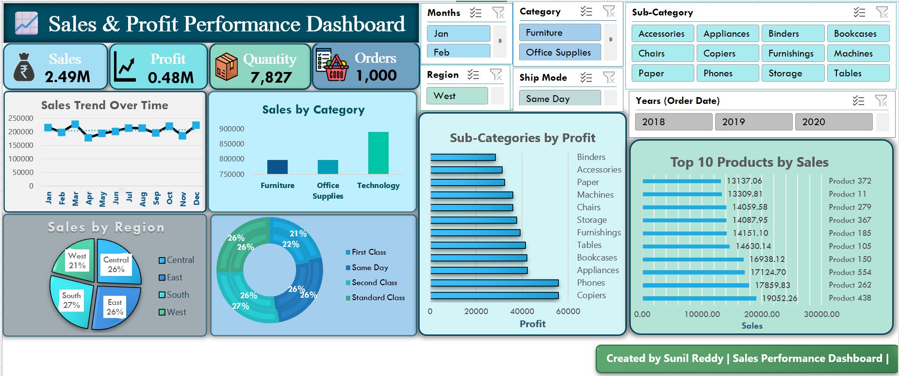

# 📊 Sales & Profit Performance Dashboard (Excel)

This project presents an **interactive Excel dashboard** that visualizes key business metrics across sales, profit, customer orders, categories, and regional performance.  
It enables deeper insight into business trends, growth patterns and product profitability through dynamic filtering and visual analytics.

---

## 🚀 Key Business Metrics

| Metric | Value |
|--------|-------|
| 💰 Total Sales | **₹2.49M** |
| 📈 Total Profit | **₹0.48M** |
| 📦 Units Sold | **7,827** |
| 🧾 Total Orders | **1,000+** |

---

## 🧭 Dashboard Overview

This dashboard allows exploration and insight through:

- 📅 Month-wise Sales Trend  
- 🏷 Category-wise & Sub-Category Profit Comparison  
- 🌍 Region-wise Revenue Distribution  
- 🚚 Ship Mode Performance Tracking  
- 🥇 Top 10 Revenue Generating Products  
- 🎛 Interactive Slicers for drill-down analysis  
  *(Month | Category | Region | Ship Mode | Year)*

---

## 🖼 Dashboard Preview

---

## 📌 Insights Generated

📍 Technology category drove the highest revenue  
📍 South & Central regions performed stronger vs others  
📍 Revenue increases gradually month over month  
📍 Top 10 SKUs contribute major revenue share  
📍 Sub-category profitability varies — optimization potential exists  

---

## 🛠 Tools Used

| Tool | Usage |
|------|--------|
| **Microsoft Excel** | Dashboard Development |
| **Pivot Tables** | KPI Computation & Aggregation |
| **Pivot Charts** | Performance Visualization |
| **Slicers & Filters** | Interactive Data Segmentation |
| **Formatting & KPI Cards** | Visual Hierarchy for Insights |

---

## 🔗 Update These After Upload (Important)

| Type | Link (Replace after repo publish) |
|------|-----------------------------------|
| GitHub Repository | https://github.com/your-repository-link |
| Dashboard File (.xlsx) | https://github.com/.../Sales_Dashboard.xlsx |
| Dashboard Image Preview | https://github.com/.../Dashboard-Screenshot-Excel.png |

---

